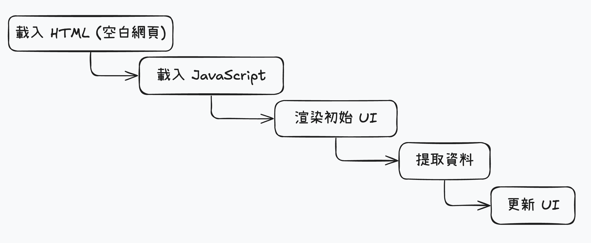

# 伺服器端的 React

雖然 React 起初的設計是一套 client 端的函式庫，但我們接下來要了解...

- SSR 為何日益需求增加
- 和一般 client-only React 有什麼不同
- 如何使用 SSR 加強 React 應用

---

# 用戶端的渲染限制


React 自發布以來一直作為建立 UI 的重要工具，因為以下的局限性，使得開發上人透過 SSR 下去解決。

- SEO
- 效能
- 資訊安全

---
hideInToc: true
layout: two-cols
layoutClass: gap-16
---

# SEO

當網路爬蟲遇上 CSR (Client Side Render) 時會遇到一些問題：

- 網路爬蟲無法正確地檢索內容
- 無法確保爬蟲可以如期執行 Javascript 
- 對於 CSR 做法的網站，搜尋引擎是否可以透過爬蟲方式觸及，目前是有疑問的

<br/>

### 實驗 
2015 年， Search Engine Land 發表了一篇[文章](https://oreil.ly/r5hF2)，我們可以得知 Google 和 Bing 可以檢索 client-only 的網站

CSR 領域範圍做法多元，即使有相關研究專案，也**不能全面保證可以正確爬取相關資訊**。

::right::

<div class="flex items-center h-full">
     
</div>

---
hideInToc: true
zoom: 0.75
---

### 傳統 SSR 與現代 CSR 渲染模式比較

| 特性 | **傳統 Web 應用程式 (SSR)** | **單頁應用程式 (SPA, React 等)** |
| :--- | :--- | :--- |
| **HTML 回應內容** | 伺服器傳送**完整的 HTML**，包含所有內容、連結與資料。 | 伺服器傳送**幾乎為空的 HTML 骨架**，只包含掛載點與 JavaScript 載入指令。 |
| **內容來源** | 伺服器在請求時即時**算繪並輸出**。 | 瀏覽器下載並執行 JavaScript 檔案後，於**客戶端動態渲染**。 |
| **SEO 友善性** | 搜尋引擎爬蟲能**直接讀取**完整的頁面內容，SEO 友善性高。 | 爬蟲需**支援 JavaScript 執行**才能讀取內容，SEO 可能受限（但 Google 爬蟲已能處理）。 |
| **首次載入體驗** | **快速**。使用者能立即看到頁面內容。 | **較慢**。<br/>需下載並執行 JavaScript 後才能顯示內容，導致**Network Waterfall**。 |
| **頁面動態互動** | 每次頁面轉換需**重新載入整個網頁**，與伺服器進行完整請求。 | 頁面轉換在客戶端完成，前端可**即時更新 UI**，不需重新整理，使用者體驗流暢。 |
| **伺服器負擔** | 較高。伺服器需為每個請求執行算繪。 | 較低。伺服器主要提供靜態檔案。 |
| **適合情境** | 內容導向的網站，如部落格、新聞網站、電商網站首頁。 | 互動性高的應用程式，如儀表板、社群媒體。 |

### 即使現代搜尋引擎可以解析 CSR 網站，但缺乏伺服器的對應做法仍有風險。

---
hideInToc: true
---

# 效能

- CSR 在效能上有可能可能遇到效能問題，因為渲染的過程是是先下載、解析再執行 JavaScript。當我們在設備比較老舊或是網路不佳的地方，很有可能會花上更長的時間等待執行完畢，進一步影響使用者體驗。
- 這種「多久才能開始互動」的時間是一個重要指標，並且會影響使用者被吸引程度和跳出率（bounce rate)，進一步對 SEO 排名有負面影響。
- 在更廣泛的範疇來看，我們想做具有大量內容的網站或是應用程式，並希望可以遵循 web 標準最佳做法的目標上，CSR 因為效能和 SEO 問題是很難達到目的的，這也凸顯了對於 **SSR** 和 **SSG** 的需求。

<br/>

### 漸進加強原則

- SSR 的做法符合**漸進加強原則**，因為 Web 初始設計JavaScript 的用途就是作為增強使用者體驗與互動，CSR 的做法是把標記文本的內容再經過JavaScript 渲染後才完整呈現。
- 如果我們用SSR 的做法，即可確保使用者和搜尋引擎都能使用基本內容與功能，瀏覽器本身只需要執行少數增強功能。
- JavaScript 的角色是加強網頁，而不是成為網頁。

---
hideInToc: true
layout: two-cols
layoutClass: gap-16
---

# Render By CSR

- 透過 API 取得資料，進行 CSR
- 手法：
    - `useEffect` -> 取得資料
    - `useState` -> 紀錄狀態

問題：
<br/>
**不良的 SEO，搜尋引擎爬蟲無法看到內容（空白畫面或是後備畫面）**


::right::

```jsx
import React, { useEffect, useState } from "react";

const Home = () => {
    const [data, setData] = useState([]);

    useEffect(() => {
        fetch("https://api.example.com/data")
            .then((response) => response.json())
            .then((data) => setData(data));
    }, []);

    return (
        <div>
            {data.map((item) => (
                <div key={item.id}>{item.title}</div>
            ))}
        </div>
    );
};

export default Home;
```

---
hideInToc: true
---

# Network Waterfall 

另外一個 csr 常見的問題。初始網頁載入被延遲，因為中間過程中必須先下載、解析、執行大量的 JavaScript。 

在網路資源有限的狀況下 會經過一段長時間的等待。由前面的例子，初始html 載入後才進行資料提取行為，也算是一種 Network Waterfall。

如果是透過 SSR 方式，使用者可以在首次載入時渲染已經提取資料的 html 文本，那就不會產生 Network Waterfall。

<div class="flex justify-center">
  
</div>

---
hideInToc: true
---

# 資訊安全

CSR 的所有資源請求的都是從使用的瀏覽器進，當然請求 API 也是，所以很容易遭受跨站請求偽造（CSRF）等攻擊。


### CSRF 為什麼會發生

CSRF（Cross-Site Request Forgery，跨站請求偽造）的重點是：
> 攻擊者讓你的瀏覽器在你不知情的情況下，發送一個「合法但惡意」的請求到可信任伺服器。

例子：

- 你已登入銀行網站，cookie 存著 session。

- 攻擊者寄你一封釣魚信，裡面藏一個 `<form action="https://bank.com/withdraw" method="POST">`

- 你一點開信頁面，瀏覽器就會自動帶上銀行的 cookie，POST 出去。

- 如果銀行的伺服器沒驗證 CSRF token，它會以為這是你本人操作，就把錢匯出去了。

---
hideInToc: true
layout: two-cols
layoutClass: gap-16
zoom: 0.8
---

## EX: CSR : 不安全提交請求

- 伺服器沒辦法產生或注入「CSRF token」
- 前端也沒法和後端協調「這個 token 是伺服器簽發的」
- 所以攻擊者可以更容易模仿請求結構

換句話說，csr 的 app 在安全層面上和「沒有伺服器的靜態網站」差不多，只要你使用的 API 沒自己做好防護，就暴露在風險下。

### 加上 SSR 後能多做什麼？

如果你有伺服器（Next.js SSR、Express、NestJS…），就能：

1. 在伺服器端生成頁面時嵌入 CSRF token（或 session-based token）
2. 在回傳的 HTML 裡放 token
3. 瀏覽器在發送下一次 POST 請求時帶上這個 token
4. 伺服器驗證 token 是否正確、是否過期

這樣就能確保請求真的是「從你的 app 的頁面」送出的，而不是別的惡意網站。

:: right::

```jsx
import React, { useState } from "react";

const Account = () => {
    const [balance, setBalance] = useState(100);

    const handleWithdrawal = async (amount) => {
        // 假設這個請求被發送到伺服器以處理提款
        const response = await fetch("/withdraw", {
            method: "POST",
            headers: { "Content-Type": "application/json" },
            credentials: "include",
            body: JSON.stringify({ amount }),
        });
        if (response.ok) {
            const updatedBalance = await response.json();
            setBalance(updatedBalance);
        }
    };

    return (
    <div>
      <h1>Account Balance: {balance}</h1>
      <button onClick={() => handleWithdrawal(10)}>Withdraw $10</button>
      <button onClick={() => handleWithdrawal(50)}>Withdraw $50</button>
      <button onClick={() => handleWithdrawal(100)}>Withdraw $100</button>
    </div>
    );
};

export default Account;
```

---
hideInToc: true
---

### 資訊安全

- 如果你根本沒有伺服器端控制權（只能 push 靜態檔），那就有 CSRF 風險。
- 如果你有伺服器端控制權（可以發 CSRF token、驗證請求），那風險可控。
- 既然你都能控制伺服器了，乾脆直接做 SSR，不只安全更好，SEO、效能也順便改善。

<br/>
<div class="flex justify-center">
  
</div>
