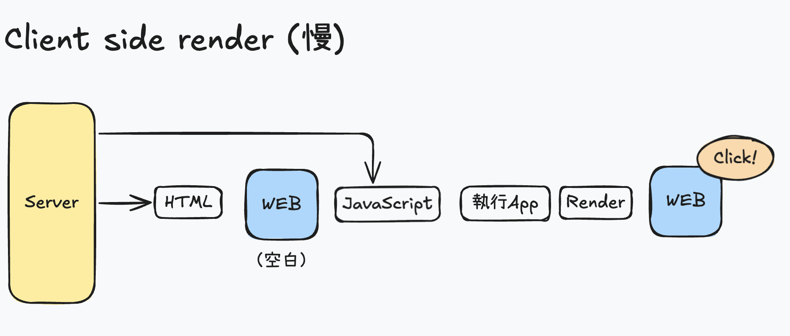
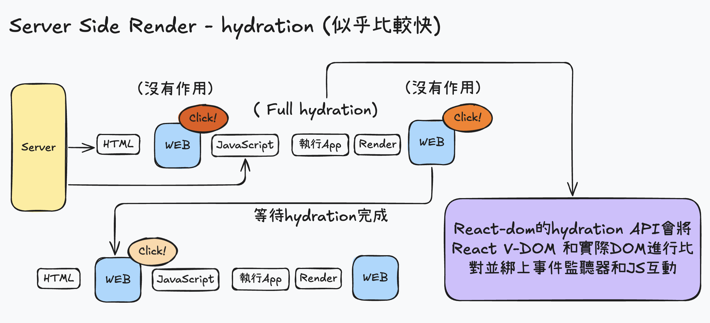
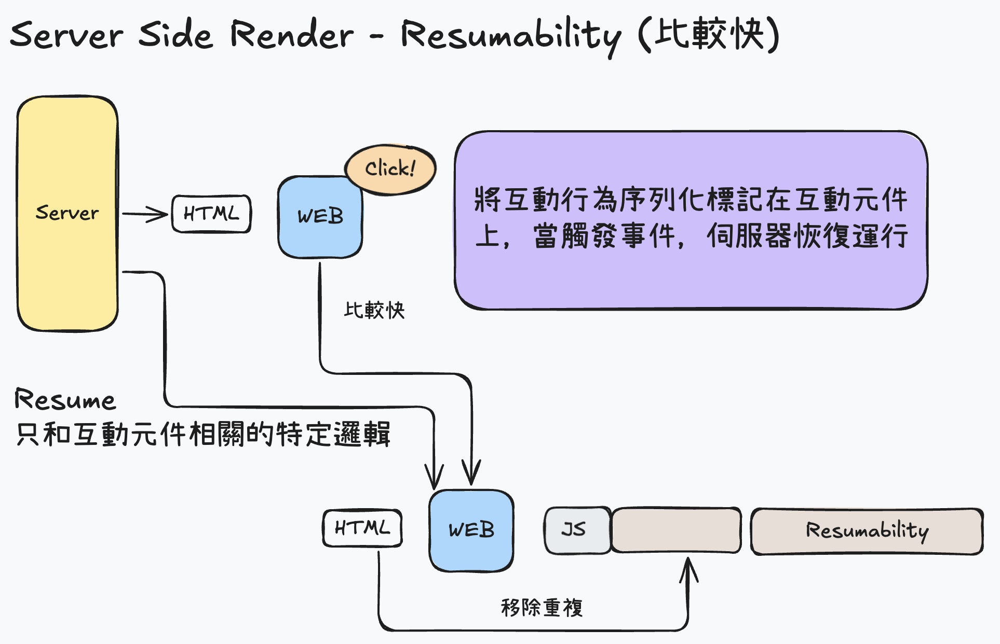

# Hydration

> 目的：讓 SSR 應用程式在載入後具備完整功能
>
> 做法：伺服器生成靜態 HTML 之後，附加事件監聽器和 JavaScript 功能在靜態的 HTML 上。

 

### 進行步驟：
1、載入用戶端包裹

渲染靜態 HTML 時，也會下載並解析包含應用程式碼的 Javascript Bundle，其中也包含 React 相關需要的程式碼。

2、附加事件監聽器

React 在完整被載入後，會使用 react-dom 的 `hydrate` 函式將監聽事件和其他動態功能附加到 DOM 元素來「 hydrate 」靜態 HTML， 該函式是以參數接收  React 根組件和 DOM 容器。

在 Hydration 過程中，React 會去比對「 靜態 HTML DOM 元素結構」和「React 組件透過 JSX 來定義結構」，兩者相符才能正確綁定事件監聽器與 React 元素映射到實際 DOM 元素，若不相符則會導致應用程式有意外發生。


Hydration 過程完成後，應用程式就具備完整互動功能，視回應使用者的輸入，提取資料和更新 DOM。

透過 SSR 和 Hydration ，開發者可以製作迅速載入且提供流暢互動體驗的 Web 應用程式。

---
hideInToc: true
layout: two-cols
layoutClass: gap-8
---

# Hydration 是有害的

> 這一段是在討論更貼近極限使用者的情境

在 hydration 的過程中，我們為了讓畫面元件正常運作

- `react-dom` 會將 Virtual DOM 與真實的DOM 進行比對並賦予實際功能。
- React 並不知道哪個元件會被使用者優先操作，所以它只能 `全部都 hydrate`。
- 再更極端的網路環境下，可能會看到了畫面資訊，但因為 react 還沒完成hydration ，所以按鈕（元件）是不能互動的。

::right::

  
  

--- 
hideInToc: true
layout: two-cols
layoutClass: gap-8
---

### 另外一種做法：Resumability

 

- 它在client 端就已經`記住了`事件與狀態，前端只要在第一次互動時`喚醒`對應邏輯就好。
- 在元件上面序列化的標記互動資訊，此時元件可以視需求具有互動能力，可從伺服器暫停之虛恢復運行(resume)。
- 因為沒有hydration 步驟因此可以縮短 TTI （time to interactive，可以開始互動之前的時間），提供再更好的使用者體驗。

 

> 雖然resumability 確實讓TTI快了幾毫秒，但是否值得以實作複雜性來換取是 React 社群還在爭論的話題。

::right::

  

