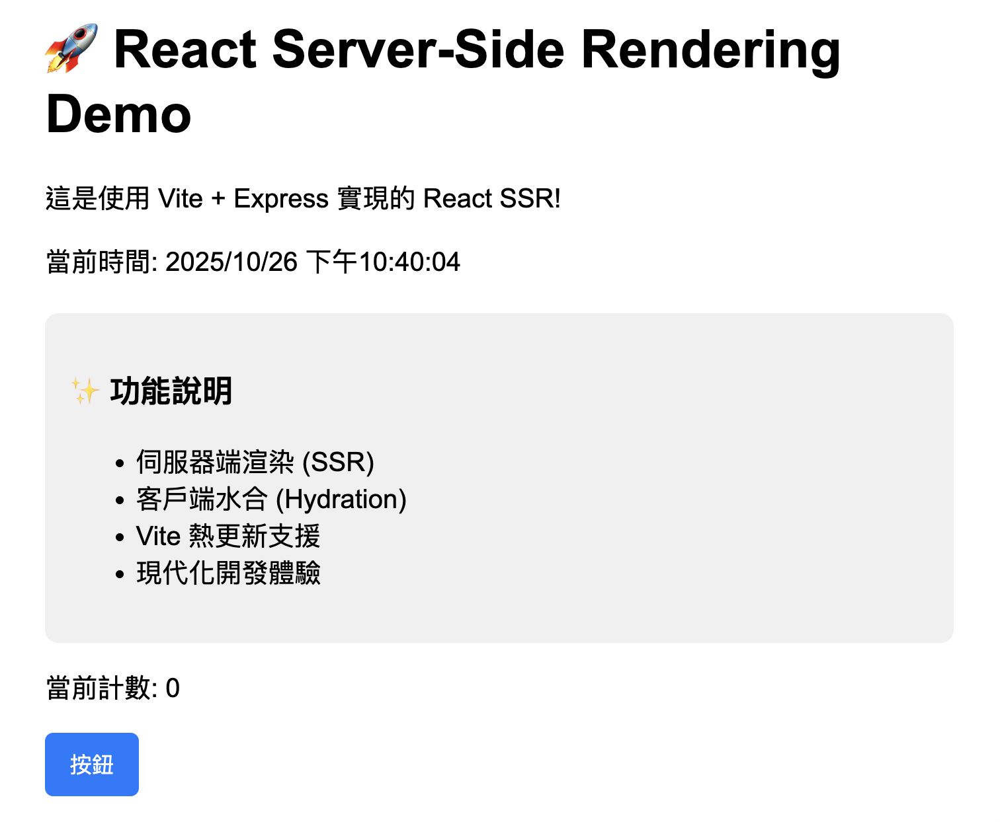
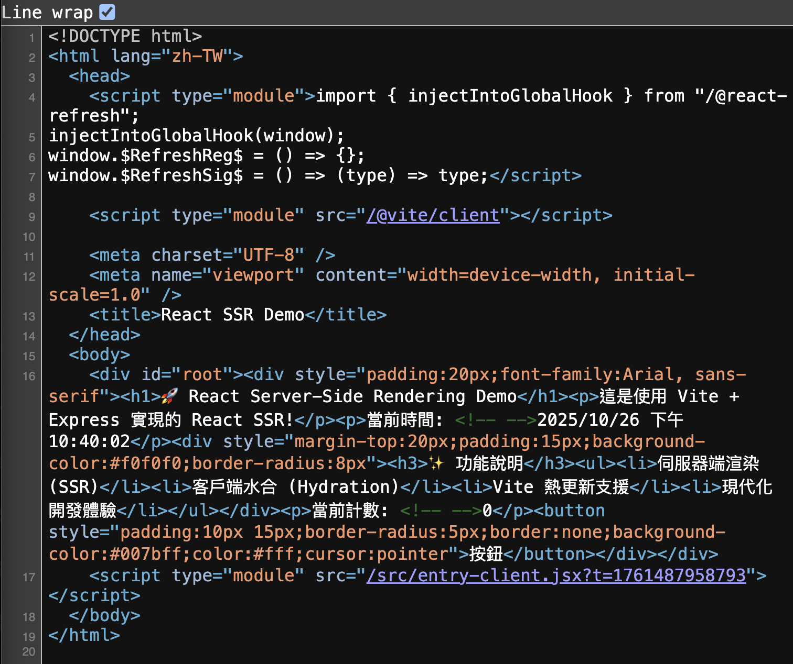

# 建立伺服器渲染

- 目前在 React 的應用程式中，想達成伺服器渲染最直接的方式是用伺服器渲染框架。

- 比如：`Next.js` 或是 `Remix`

---
hideInToc: true
---

# 將伺服器渲染手動加入 client-only React app

參考實作：[react server side render demo](https://github.com/Yo0GuitarIT/react-ssr-demo)

檢查網頁原始碼是否是真的是伺服器渲染：

<div grid="~ cols-2 gap-2">
  <div style="border: 1px solid black" border="rounded">
    
  </div>
  
  
</div>

---
hideInToc: true
---

# Hydrating

目標是將事件監聽和其他 JavaScript 功能附加到靜態的 HTML。

```jsx
import { hydrateRoot } from "react-dom/client";
import App from "./app.jsx";

// 客戶端水合 (Hydration)
hydrateRoot(document.getElementById("root"), <App />);
```

-> NOTE:  此時 APP 才真正具備互動功能。