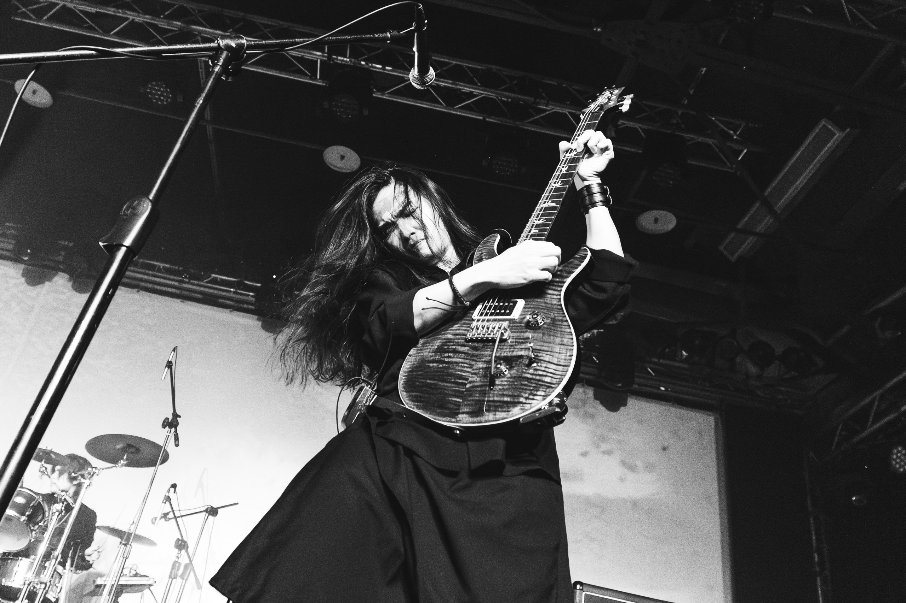

# 目次

<Toc text-sm minDepth="1" maxDepth="2" />

---
layout: two-cols
layoutClass: gap-16
hideInToc: true
---

<div class="flex items-center h-full">
     
</div>

::right::

# 自我介紹

- Yo0
- 一年經驗前端工程師
- 興趣
    - 彈吉他
    - 看動漫

<br/>

```bash
💻 Code with logic.
🎸 Play with soul.
```

---

# 章節回顧
